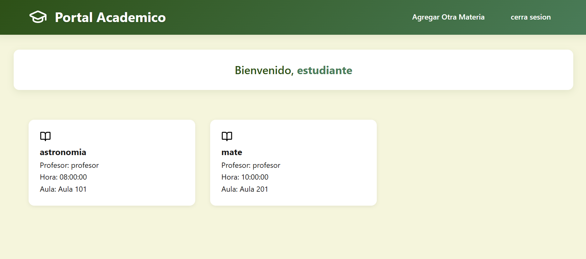
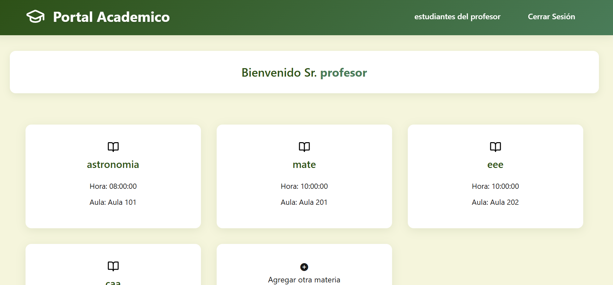
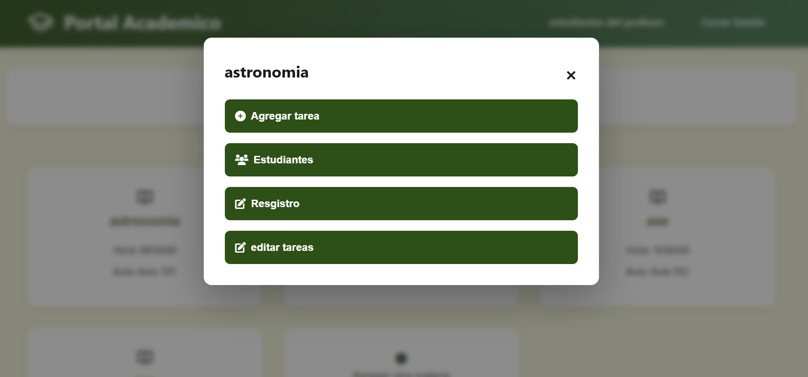
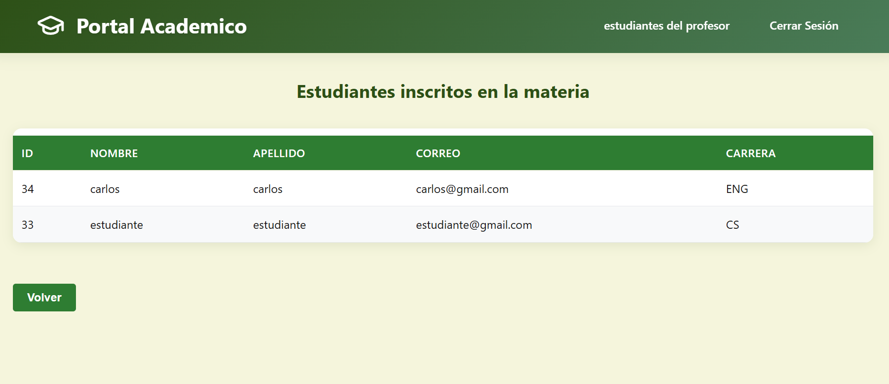

# 🎓 Plataforma Educativa

Este es un sistema de gestión educativa que permite la interacción entre profesores y estudiantes, facilitando la administración de materias, tareas y calificaciones.

## 📸 Vista Previa del Proyecto

### Interfaz de Profesores

*Panel de control para profesores*

### Interfaz de Estudiantes

*Panel de control para estudiantes*

### Gestión de Materias

*Vista de opciones de la materia*

### Sistema de Tareas

*Interfaz de lista de estudinates que ven la materia*

## 🚀 Tecnologías Utilizadas

### Frontend
- 🌐 HTML5, CSS3 y JavaScript
- 🎨 Bootstrap (para el diseño responsivo)
- 📱 Diseño adaptativo para todos los dispositivos

### Backend
- ⚙️ Node.js con Express
- 🗄️ MySQL (base de datos)
- 🔐 Express-session (manejo de sesiones)
- 📧 Nodemailer (para envío de correos)
- 📦 Multer (manejo de archivos)

## ✨ Características Principales

### Para Profesores
✅ Registro e inicio de sesión seguro
✅ Gestión de materias y horarios
✅ Asignación de tareas con archivos adjuntos
✅ Calificación de tareas de estudiantes
✅ Visualización de estudiantes matriculados
✅ Control de asistencia y notas

### Para Estudiantes
✅ Registro e inicio de sesión seguro
✅ Matrícula de materias disponibles
✅ Visualización de tareas asignadas
✅ Envío de respuestas con archivos adjuntos
✅ Seguimiento de calificaciones
✅ Historial de materias matriculadas

## 🛠️ Instalación Local

1. Clonar el repositorio:
```bash
git clone [URL_DEL_REPOSITORIO]
cd [NOMBRE_DEL_PROYECTO]
```

2. Instalar dependencias:
```bash
npm install
```

3. Configurar la base de datos:
- Crear una base de datos MySQL llamada 'students'
- Configurar las credenciales en el archivo server.js

4. Iniciar el servidor:
```bash
npm start
```

## 📁 Estructura del Proyecto

```
├── public/
│   ├── css/
│   ├── js/
│   └── html/
├── server.js
├── package.json
└── README.md
```

## 🔒 Seguridad

- Autenticación de usuarios
- Manejo de sesiones
- Validación de datos
- Protección contra inyección SQL
- Encriptación de contraseñas

## 🌐 Características Técnicas

- API RESTful
- Manejo de archivos y subidas
- Sistema de notificaciones
- Validación de horarios
- Control de acceso basado en roles

## 📝 Notas Adicionales

- El sistema está diseñado para ser escalable
- Implementa buenas prácticas de programación
- Incluye manejo de errores robusto
- Documentación en línea del código


